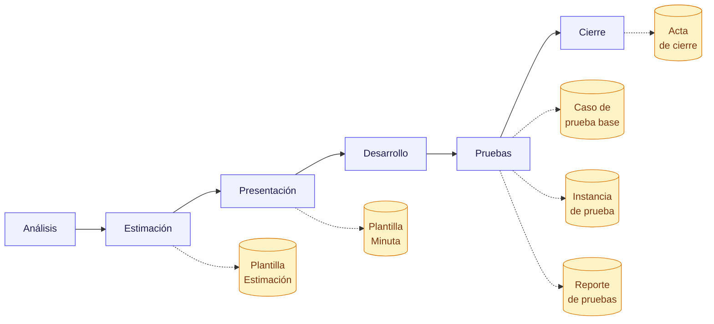

---
hide:
  - navigation
---

# :material-file-document-multiple-outline: Plantillas operativas

!!! abstract "Formatos reutilizables del proyecto"
    Plantillas estandarizadas para documentar **casos de prueba, ejecuciones, minutas, estimaciones, reportes y cierres**. Toda salida formal del proyecto sigue una de estas plantillas para garantizar consistencia y trazabilidad.

---

## :material-source-branch: Por etapa del ciclo

---

## :material-format-list-bulleted-type: Catálogo

-   :material-test-tube:{ .lg .middle } **Caso de prueba base**

    ---

    Define un **caso maestro reutilizable** (`CB-…`) que se valida una y otra vez a lo largo del proyecto.

    Pasos, precondiciones, datos de entrada y criterios de aceptación.

    [:octicons-arrow-right-16: Abrir plantilla](caso-prueba-base.md)

-   :material-clipboard-play-outline:{ .lg .middle } **Instancia de prueba**

    ---

    **Ejecución concreta** (`EX-…`) de un caso base en una fecha, entorno y versión específica.

    Captura el resultado de esa corrida puntual.

    [:octicons-arrow-right-16: Abrir plantilla](instancia-prueba.md)

-   :material-note-text-outline:{ .lg .middle } **Minuta de reunión**

    ---

    Resumen escrito de una reunión: **quién participó, qué se discutió y qué se acordó**.

    Acuerdos y próximos pasos con responsables.

    [:octicons-arrow-right-16: Abrir plantilla](minuta-reunion.md)

-   :material-calculator-variant-outline:{ .lg .middle } **Estimación de horas**

    ---

    **Planilla formal** con desglose por etapa, supuestos y riesgos.

    Presenta rango (mín / máx) y registra la aprobación del cliente.

    [:octicons-arrow-right-16: Abrir plantilla](estimacion.md)

-   :material-clipboard-check-multiple-outline:{ .lg .middle } **Reporte de pruebas**

    ---

    Cierre de una ronda de pruebas: **resultado por criterio, defectos y recomendación**.

    Aprobado / con observaciones / rechazado.

    [:octicons-arrow-right-16: Abrir plantilla](reporte-pruebas.md)

-   :material-file-check-outline:{ .lg .middle } **Acta de cierre**

    ---

    **Cierre formal** de requerimiento o sprint: verificación post-deploy y consumo real de horas.

    Confirma despliegue y queda como evidencia del cierre.

    [:octicons-arrow-right-16: Abrir plantilla](acta-cierre.md)

---

## :material-account-group-outline: Quién usa cada plantilla

=== ":material-clipboard-text-outline: Referente funcional"

    | Plantilla | Cuándo |
    |---|---|
    | [Minuta de reunión](minuta-reunion.md) | Después de cada reunión formal |
    | [Estimación de horas](estimacion.md) | Para validar y aprobar el esfuerzo de un requerimiento |
    | [Acta de cierre](acta-cierre.md) | Al cerrar formalmente un requerimiento o sprint |

=== ":material-code-tags: Desarrollo"

    | Plantilla | Cuándo |
    |---|---|
    | [Estimación de horas](estimacion.md) | Al estimar un requerimiento aprobado |
    | [Acta de cierre](acta-cierre.md) | Tras desplegar y verificar en producción |

=== ":material-checkbox-marked-circle-outline: QA y validación"

    | Plantilla | Cuándo |
    |---|---|
    | [Caso de prueba base](caso-prueba-base.md) | Al diseñar un caso maestro reutilizable |
    | [Instancia de prueba](instancia-prueba.md) | Al ejecutar el caso en un entorno y versión |
    | [Reporte de pruebas](reporte-pruebas.md) | Al cerrar la ronda completa de pruebas |

---

## :material-format-letter-case: Convención de nombres

!!! info "Códigos estándar"
    - :material-bookmark: **Casos base:** `CB-<NOMBRE>` — ej. `CB-LOGIN`, `CB-REGISTRO`
    - :material-clipboard-play-outline: **Instancias de prueba:** `EX-<NOMBRE>-<YYYY-MM-DD>` — ej. `EX-LOGIN-2026-05-15`
    - :material-link-variant: **Regla:** una instancia siempre referencia **un único** caso base
